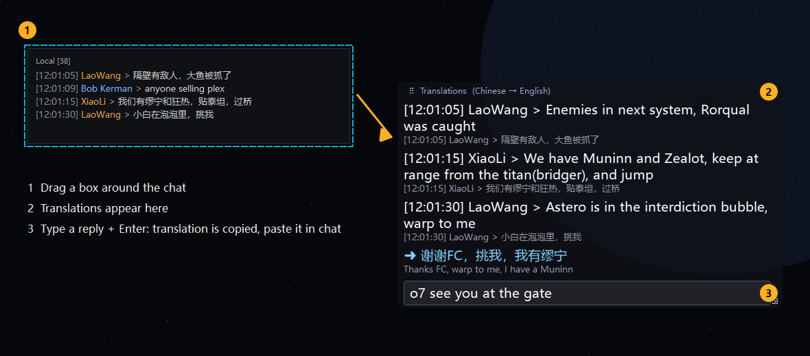
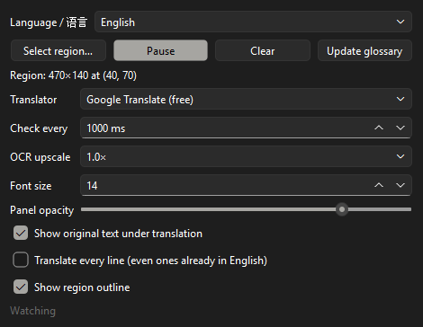

# EVE Chat Translator

**English** | [简体中文](README.zh-CN.md)

Live translation overlay for EVE Online chat, **English ⇄ Chinese**. Drag a box around a chat window
and new lines are read off the screen and shown translated in a small always-on-top panel. You can also
type a reply in your own language; the translation is copied to your clipboard, ready to paste.



## Features

- **Reads chat from the screen** using built-in offline OCR (RapidOCR). Nothing is installed into the game.
- **Both directions**: English speakers read Chinese chat in English, and Chinese speakers read English chat in Chinese.
- **Reply box**: type a message, press Enter, and paste the translation into EVE chat.
- **Knows EVE slang**: a community glossary (fleet commands, intel, mining terms) plus the official Chinese names of every ship.
- **Three translators**: Google (free), Baidu (works in mainland China) and Claude (best with slang).
- **English or Chinese interface**, switchable at any time.

## Installation (Windows)

1. Install [Python 3.11 or newer](https://www.python.org/downloads/). Tick **"Add python.exe to PATH"** during setup.
2. Download this project (**Code → Download ZIP**, then unzip it) or `git clone` it.
3. In the project folder, open a terminal and run:
   ```bat
   python -m venv .venv
   .venv\Scripts\pip install -r requirements.txt
   ```
4. Double-click **`Chat Translator.bat`** to start.

The first start takes a few seconds while the OCR models load and the slang glossary downloads.

## How to use

### 1. Choose your language and translator



- **Language / 语言**: the language *you* read. In **English**, Chinese chat is translated to English.
  In **中文**, English chat is translated to Chinese and the whole interface switches to Chinese.
- **Translator**:
  | Translator | Setup | Notes |
  |---|---|---|
  | Google Translate | none | Free default. Blocked in mainland China. |
  | Baidu Translate | free APP ID + key from [fanyi-api.baidu.com](https://fanyi-api.baidu.com) | Works in mainland China. |
  | Claude | Anthropic API key | Best with slang and context. Paid per use. |

### 2. Select the chat

Click **Select region…** and drag a box around the chat text, as in step ① above. A dashed outline marks
the watched area. Click **Pause** / **Start** any time, or **Select region…** again to move it.

### 3. Read the translations

New messages appear in the translation panel ②, translation first with the original in grey underneath.
Drag the panel by its top bar and resize it from the bottom-right corner. It can safely sit on top of
the chat, because the app never reads its own panel.

### 4. Reply

Type in the box at the bottom of the panel ③ and press **Enter**. The translation appears in blue and
is **copied to your clipboard**. Click into EVE's chat and press **Ctrl+V** to send it.

## Tips

- **EVE must run in windowed or borderless (fixed window) mode**; overlays can't appear over fullscreen.
- Small chat font misread? Set **OCR upscale** to 1.5× or 2×, or increase EVE's chat font size.
- Messages that wrap onto two lines are translated as two separate lines.
- **Update glossary** downloads the latest version of the community slang sheet.
- Add your own terms to `data/glossary_custom.csv` (`chinese,english` per line); they take priority.

## The EVE glossary

Translations use an EVE-specific glossary in both directions, so fleet calls come through correctly
(挑我 = warp to me, 大鱼 = Rorqual, 泡泡 = interdiction bubble):

1. `data/glossary_custom.csv`: your own terms (highest priority)
2. The community [EVE slang sheet](https://docs.google.com/spreadsheets/d/1r3wM2W1tbchWn59fAIhMrvfN0uOAAKcSMZbAga_xQik),
   downloaded on first start
3. `data/ships.json`: official Chinese ship names from CCP's ESI (e.g. 矮脚鸡级 = Bantam)

## Safety and privacy

- The app **only reads screen pixels** inside the box you draw, like taking a screenshot.
- It **never touches the EVE client**: no process access, no memory reading, no client modification.
- It **never sends input to the game**. You paste and send every message yourself.
- The text it reads is sent to the translator you choose (Google, Baidu or Anthropic). Point it at
  public channels such as Local or public intel, not private corp/alliance chat.
- Settings, including API keys, are stored in plain text in `%APPDATA%\ChatTranslator\config.json`.

## For developers

```
chat_translator/
  app.py         UI: settings window, region selector, translation panel
  worker.py      background thread: change detection, OCR, de-duplication, translation
  ocr.py         RapidOCR wrapper, groups text boxes into chat lines
  translate.py   Google / Baidu / Claude backends, both directions
  glossary.py    EVE glossary loading and term substitution
  i18n.py        interface strings (English / 中文)
docs/make_screenshots.py   regenerates the images in this README
```

## Legal

EVE Online and the EVE logo are the registered trademarks of CCP hf. All rights are reserved worldwide.
All other trademarks are the property of their respective owners. EVE Online, the EVE logo, EVE and all
associated logos and designs are the intellectual property of CCP hf. All artwork, screenshots,
characters, vehicles, storylines, world facts or other recognizable features of the intellectual property
relating to these trademarks are likewise the intellectual property of CCP hf. CCP hf. has granted
permission to this project to use EVE Online and all associated logos and designs for promotional and
information purposes on its website but does not endorse, and is not in any way affiliated with, this
project. CCP is in no way responsible for the content on or functioning of this project, nor can it be
liable for any damage arising from the use of this project.

Licensed under the [MIT License](LICENSE).
