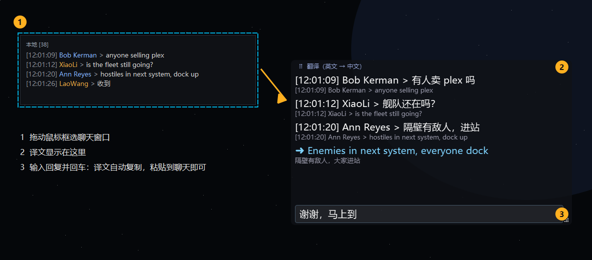
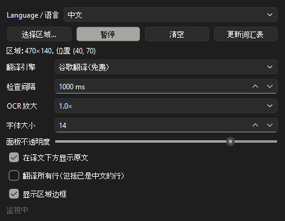

# EVE 聊天翻译器

[English](README.md) | **简体中文**

EVE Online 聊天实时翻译悬浮窗，支持**英文 ⇄ 中文**。框选游戏里的聊天窗口，新消息会被自动识别，
翻译后显示在一个始终置顶的小面板中。你也可以用中文输入回复，译文会自动复制到剪贴板，直接粘贴发送即可。



## 功能

- **从屏幕读取聊天内容**：内置离线 OCR（RapidOCR），不需要往游戏里安装任何东西。
- **双向翻译**：中文玩家看英文聊天显示中文，英文玩家看中文聊天显示英文。
- **回复框**：输入消息并回车，把译文粘贴到 EVE 聊天中。
- **懂 EVE 术语**：内置玩家整理的术语表（舰队指令、预警、挖矿用语），以及所有舰船的官方中文名。
- **三种翻译引擎**：谷歌（免费）、百度（国内可用）、Claude（最懂俚语）。
- **中英文界面**，随时切换。

## 安装（Windows）

1. 安装 [Python 3.11 或更新版本](https://www.python.org/downloads/)。安装时请勾选 **"Add python.exe to PATH"**。
2. 下载本项目（点击 **Code → Download ZIP** 后解压），或使用 `git clone`。
3. 在项目文件夹中打开终端，运行：
   ```bat
   python -m venv .venv
   .venv\Scripts\pip install -r requirements.txt
   ```
   国内网络较慢时，可以使用清华镜像：
   ```bat
   .venv\Scripts\pip install -r requirements.txt -i https://pypi.tuna.tsinghua.edu.cn/simple
   ```
4. 双击 **`Chat Translator.bat`** 启动。

首次启动需要几秒钟加载 OCR 模型。

## 使用方法

### 1. 选择语言和翻译引擎



- **Language / 语言**：选择**你自己**阅读的语言。选择 **中文** 后，英文聊天会被翻译成中文，界面也会切换为中文。
- **翻译引擎**：
  | 引擎 | 设置 | 说明 |
  |---|---|---|
  | 谷歌翻译 | 无需设置 | 免费，默认选项。**国内无法访问。** |
  | 百度翻译 | 需要免费的 APP ID 和密钥 | **国内推荐使用。** 申请方法见下文。 |
  | Claude | 需要 Anthropic API 密钥 | 最懂俚语和上下文，按用量付费。国内无法直接访问。 |

#### 申请百度翻译 APP ID（免费）

1. 打开 [百度翻译开放平台](https://fanyi-api.baidu.com)，用百度账号登录。
2. 进入「管理控制台」，开通 **通用文本翻译**（标准版免费，完成个人认证后免费额度更高）。
3. 在「开发者信息」中找到 **APP ID** 和 **密钥**。
4. 在本软件的「翻译引擎」中选择 **百度翻译**，填入 APP ID 和密钥即可。

### 2. 框选聊天窗口

点击 **选择区域…**，然后拖动鼠标框住聊天文字，见上图中的 ①。虚线框表示正在监视的区域。
可以随时点击 **暂停** / **开始**，或再次点击 **选择区域…** 重新框选。

### 3. 查看译文

新消息会出现在翻译面板中（②）：上面是译文，下面灰色小字是原文。拖动面板顶部的标题栏可以移动，
拖动右下角可以调整大小。面板可以放在聊天窗口上方，软件不会识别自己的面板。

### 4. 回复

在面板底部的输入框（③）中输入中文并按 **回车**。译文会以蓝色显示，并**自动复制到剪贴板**。
点击 EVE 的聊天输入框，按 **Ctrl+V** 粘贴发送即可。

## 小贴士

- **EVE 需要使用窗口模式或无边框窗口模式**，全屏模式下悬浮窗无法显示在游戏上方。
- 聊天字体太小、识别不准？把 **OCR 放大** 设为 1.5× 或 2×，或在 EVE 中调大聊天字体。
- 一条消息如果折成两行，会被当作两条分别翻译。
- **更新词汇表** 会下载最新的玩家术语表。
- 可以在 `data/glossary_custom.csv` 中添加自己的术语（每行 `中文,英文`），优先级最高。

## EVE 术语表

翻译时会双向使用 EVE 专用术语表，舰队指令可以被正确翻译（例如 warp to me = 挑我，Rorqual = 大鱼，
interdiction bubble = 泡泡）：

1. `data/glossary_custom.csv`：你自己的术语（优先级最高）
2. 玩家整理的 [EVE 术语表](https://docs.google.com/spreadsheets/d/1r3wM2W1tbchWn59fAIhMrvfN0uOAAKcSMZbAga_xQik)，
   首次启动时自动下载（需要能访问 Google）
3. `data/ships.json`：来自 CCP ESI 的舰船官方中文名（例如 Bantam = 矮脚鸡级）

## 安全与隐私

- 本软件**只读取你框选区域内的屏幕像素**，相当于截图。
- **完全不接触 EVE 客户端**：不访问游戏进程，不读取内存，不修改客户端。
- **不会向游戏发送任何按键或操作**，所有消息都由你自己粘贴、发送。
- 识别到的文字会发送给你选择的翻译服务（谷歌、百度或 Anthropic）。建议只框选本地、公共预警等
  公开频道，不要框选军团 / 联盟的私密频道。
- 设置（包括 API 密钥）以明文保存在 `%APPDATA%\ChatTranslator\config.json`。

## 法律声明

本项目与 CCP hf. 无任何关联，也未获得其认可。EVE Online 及 EVE 标志是 CCP hf. 的注册商标。
完整的英文声明见 [README.md](README.md#legal)。

本项目使用 [MIT 许可证](LICENSE)。
